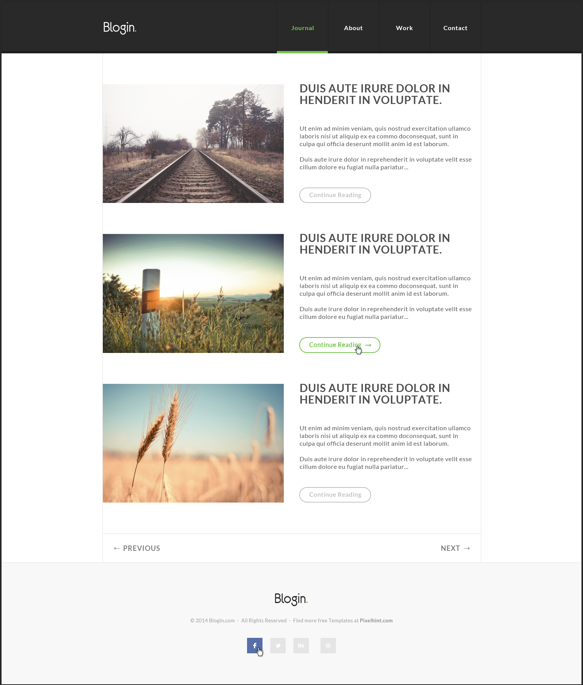

# Design2LivePage
> A web page design exercise, practicing UI and pixel-perfect design, and CSS architecture.

## General Information
This project was an exercise performed as part of a web-design workshop of the Coding Academy web-development course. The goal was to create a pixel perfect design for a live web-page from source graphics wich included an image and PSD.

## Technologies Used
- HTML5
- CSS3
- Font Awesome 6.1.1

## Requested result:

## Project Status
Project is: _complete_ 
